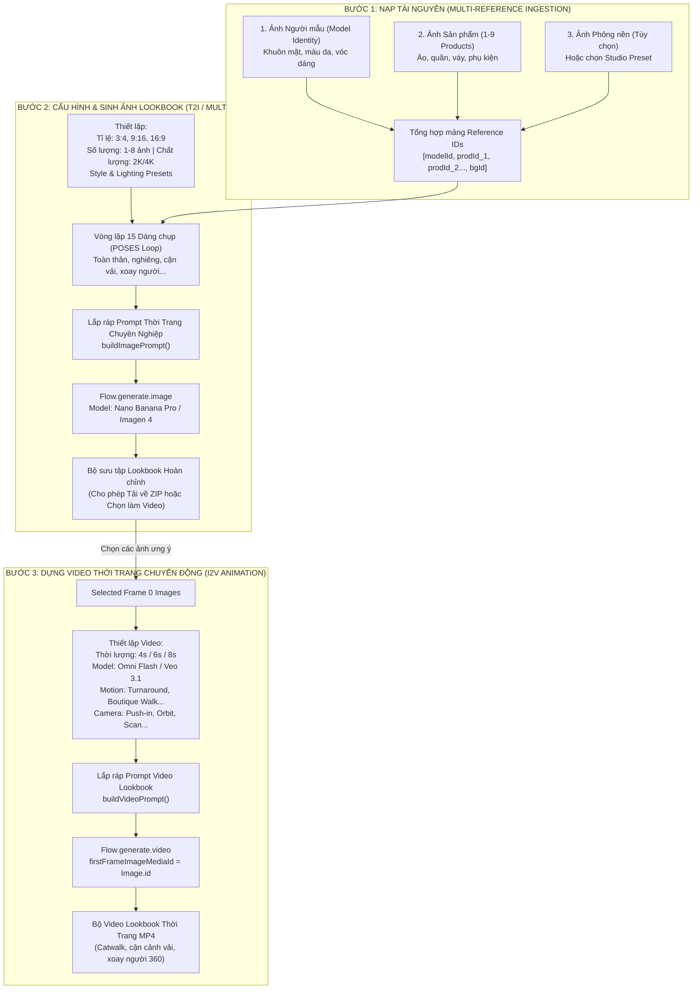

# MASTER FLOW: THỜI TRANG AI (FASHION AI LOOKBOOK & VIDEO CREATOR)
### Đặc tả kiến trúc & Quy trình kỹ thuật đảo ngược (Reverse-Engineered Master Flow)
- **Tool ID:** `c9bd7d55-130e-4aa4-9298-c2b5411b0bc3`
- **Tên gốc:** Thời trang AI
- **Tác giả:** Another Creator
- **Thời gian trích xuất:** 2026-09-18 09:25:10
- **Thư mục source code tham chiếu:** `thời_trang_ai_c9bd7d55`
- **Phạm vi ứng dụng:** Tích hợp trực tiếp vào NOVA AI Studio / FlowKit (Module Virtual Try-On, Lookbook thời trang E-commerce và Video Review TikTok Shop).

---

## 1. TỔNG QUAN HỆ THỐNG & ĐẶC ĐIỂM NỔI BẬT

Thời trang AI là một pipeline thương mại điện tử chuyên nghiệp bậc nhất, giải quyết bài toán cốt lõi của ngành thời trang số: **Thử đồ ảo đa sản phẩm (Multi-Product Virtual Try-On) kết hợp sinh Lookbook chuyển động (Fashion Video).**

### Điểm đột phá kỹ thuật:

1. **Kiến trúc tham chiếu 3 tầng (Triple-Layer Reference Engine):**
   - **Tầng 1 (Model Identity):** Khóa 100% nhân dạng người mẫu (gương mặt, màu da, kiểu tóc, vóc dáng tỷ lệ cơ thể).
   - **Tầng 2 (Garment & Products):** Hỗ trợ nạp cùng lúc 1 đến 9 sản phẩm thời trang khác nhau (áo, quần, chân váy, áo khoác, túi xách, phụ kiện...) và tự động "mặc" chuẩn xác lên người mẫu.
   - **Tầng 3 (Environment/Background):** Hỗ trợ nạp ảnh bối cảnh thực tế hoặc sử dụng các preset studio ánh sáng cao cấp.

2. **Hệ thống 15 Dáng Chụp Studio Chuẩn Quốc Tế (POSES):**
   Tự động xoay vòng 15 góc chụp (toàn thân, nhìn sau, góc nghiêng 3/4, cận cảnh chất liệu vải, cận cảnh cúc/cổ áo, tư thế xoay người catwalk...) để tạo ra bộ Lookbook thương mại hoàn chỉnh.

3. **Quy trình 2 giai đoạn khép kín (Image-to-Video Workflow):**
   - **Giai đoạn 1:** Sinh ảnh tĩnh thời trang 2K/4K bằng model 🍌 Nano Banana Pro (Imagen 4 / Flow Image).
   - **Giai đoạn 2:** Lấy chính xác ảnh tĩnh ưng ý làm Frame 0 (`firstFrameImageMediaId`), kết hợp với bộ kịch bản chuyển động (`motionPreset`) và camera (`cameraMovement`) để render video người mẫu catwalk/turnaround bằng Omni Flash hoặc Veo 3.1.

---

## 2. SƠ ĐỒ PIPELINE HOÀN CHỈNH (MERMAID)



---

## 3. CÁC THÀNH PHẦN MÃ NGUỒN CỐT LÕI

### 3.1. promptBuilder.ts — Động cơ tạo Prompt Đạo diễn

#### 15 Dáng Chụp Studio (POSES):
```typescript
export const POSES = [
  "Toàn thân, nhìn thẳng",
  "Toàn thân, nhìn từ sau",
  "Toàn thân, nhìn nghiêng",
  "Góc ba phần tư",
  "Cận cảnh từ thắt lưng trở lên",
  "Cận cảnh chi tiết chất liệu vải",
  "Cận cảnh chi tiết cổ áo / ngực",
  "Cận cảnh chi tiết tay áo / vai",
  "Cận cảnh chi tiết thắt lưng / độ ôm",
  "Cận cảnh chân váy / gấu áo",
  "Tư thế đang bước đi",
  "Tư thế đang xoay người",
  "Tư thế catalogue chuyên nghiệp",
  "Tư thế chiến dịch thời trang cao cấp",
  "Tư thế phong cách sống tự nhiên"
];
```

#### Quy tắc ráp Prompt Ảnh Lookbook (`buildImagePrompt`):
```typescript
export const buildImagePrompt = (config: ImageConfig, index: number, hasBackgroundRef: boolean) => {
  const pose = POSES[index % POSES.length];
  const backgroundInstruction = hasBackgroundRef
    ? `SỬ DỤNG CHÍNH XÁC phông nền từ hình ảnh tham chiếu phông nền đã tải lên. Giữ nguyên màu sắc, ánh sáng, vật liệu và không gian của phông nền đó.`
    : `Sử dụng bối cảnh: ${config.backgroundPreset}.`;

  const prompt = `Sử dụng hình ảnh người mẫu được cung cấp làm nhân vật chính. Giữ nguyên khuôn mặt, kiểu tóc, màu da và tỷ lệ cơ thể. Cho người mẫu mặc các sản phẩm thời trang từ ảnh tham chiếu sản phẩm. Giữ nguyên thiết kế sản phẩm, bao gồm màu sắc, chất liệu, hoa văn, đường may, cổ áo, tay áo và các chi tiết nhìn thấy được.
Tạo ảnh chụp thời trang chuyên nghiệp tỷ lệ ${config.aspectRatio}, chất lượng ${config.quality}.
Phong cách: ${config.stylePreset}.
Ánh sáng: ${config.lightingPreset}.
${backgroundInstruction}
Góc chụp: ${pose}.
Tập trung tối đa vào sản phẩm thời trang. Hiệu ứng vải thực tế, nếp gấp tự nhiên, bố cục sạch sẽ, không có watermark, không có văn bản/logo lạ, không biến dạng cơ thể.`;

  return { prompt, label: pose };
};
```

#### Quy tắc ráp Prompt Video Lookbook (`buildVideoPrompt`):
```typescript
export const buildVideoPrompt = (config: VideoConfig, image: GeneratedImage): string => {
  return `Sử dụng hình ảnh này làm tham chiếu hình ảnh chính xác. Giữ nguyên danh tính người mẫu, khuôn mặt, trang phục, chi tiết sản phẩm, chất liệu và bối cảnh.
Tạo video thời trang chất lượng cao dài ${config.duration} giây.
Người mẫu thực hiện: ${config.motionPreset}.
Camera thực hiện: ${config.cameraMovement}.
Tập trung vào sản phẩm. Chuyển động mượt mà, vật lý vải thực tế, phong cách quảng cáo cao cấp, không thay đổi khuôn mặt, không biến dạng trang phục, không watermark.`;
};
```

---

### 3.2. types.ts — Mô hình Dữ liệu Quản lý Phiên

```typescript
export interface ImageConfig {
  aspectRatio: '1:1' | '16:9' | '9:16' | '4:3' | '3:4';
  quantity: number;                                // 1, 2, 4, 6, 8
  quality: '2K' | '4K';
  imageModel: string;                              // Nano Banana Pro
  stylePreset: string;                             // Luxury boutique, Street editorial...
  lightingPreset: string;                          // Soft studio, Natural daylight...
  backgroundPreset: string;                        // Pure white studio, Boutique interior...
}

export interface VideoConfig {
  videoModel: string;                              // Omni Flash, Veo 3.1 - Fast, Veo 3.1 - Lite
  duration: number;                                // 4, 6, 8 giây
  motionPreset: string;                            // Elegant Turnaround, Full Outfit Review...
  cameraMovement: string;                          // Push-in, Head-to-Toe Scan, Slow Orbit...
  isLiteMode: boolean;                             // Chế độ ưu tiên ổn định
}

export interface FashionState {
  modelRef: MediaItem | null;                      // Người mẫu
  productRefs: MediaItem[];                        // Mảng 1-9 sản phẩm
  backgroundRef: MediaItem | null;                 // Phông nền tùy chọn
  config: ImageConfig;
  generatedImages: GeneratedImage[];
  selectedImageIds: string[];
  videoConfig: VideoConfig;
  generatedVideos: GeneratedVideo[];
}
```

---

### 3.3. WorkflowSteps.tsx — 7 Bước Thực thi Chi tiết

1. **StepUpload:**
   - Khung kéo thả Model Ref tỉ lệ 3:4 với thông báo *"Giữ nguyên danh tính"*.
   - Khung lưới sản phẩm hỗ trợ nạp tới 9 món đồ thời trang cùng lúc (áo, quần, váy, áo khoác, phụ kiện...).
   - Khung phông nền tùy chọn (`backgroundRef`).

2. **StepImageConfig:**
   - **Tỉ lệ:** 3:4 (chuẩn lookbook thời trang), 9:16 (Reels/TikTok), 16:9 (banner).
   - **Style Presets:**
     - Luxury boutique fashion
     - Clean ecommerce catalog
     - High-end fashion lookbook
     - Street fashion editorial
     - Outdoor lifestyle fashion
   - **Lighting Presets:**
     - Soft studio lighting
     - Natural daylight
     - Cinematic boutique lighting
     - Golden hour outdoor light
   - **Background Presets:**
     - Pure white studio background
     - Elegant luxury boutique interior
     - Modern minimalist architectural space
     - High-end Parisian street corner
     - Warm cozy indoor lifestyle setting

3. **StepImageGenerating:**
   - Tiến trình hiển thị 0% – 100% kèm thông điệp trạng thái thời gian thực (*Đang thiết kế bức ảnh thứ X...*).
   - Tự động gán nhãn `label` cho từng ảnh theo tên góc chụp tương ứng (*Cận cảnh chất liệu vải, Toàn thân nhìn nghiêng...*).

4. **StepImageResults:**
   - Thư viện ảnh Lookbook dạng lưới thẻ, tích hợp chọn/bỏ chọn đa điểm (`selectedImageIds`).
   - Nút *"Tải xuống tất cả"* (tải hàng loạt PNG độ phân giải cao).
   - Nút hành động chính: *"Tiếp tục tạo Video từ ảnh đã chọn"*.

5. **StepVideoConfig:**
   - **Motion Presets:**
     - `Elegant Turnaround` (Xoay người thanh lịch 360 độ).
     - `Full Outfit Review` (Trình diễn tổng thể trang phục).
     - `Fabric Detail Focus` (Cận cảnh sóng vải chuyển động).
     - `Boutique Walk` (Bước đi tự nhiên trong showroom).
     - `Luxury Campaign Pose` (Tạo dáng chiến dịch cao cấp).
   - **Camera Movements:**
     - `Cinematic Push-in` (Đẩy máy quay cận dần).
     - `Head-to-Toe Scan` (Quét từ đầu xuống chân).
     - `Slow Orbit` (Quay vòng chậm quanh người mẫu).
     - `Gimbal Track` (Bám chuyển động mượt mà).

6. **StepVideoGenerating:**
   - Gọi `Flow.generate.video` với `firstFrameImageMediaId: img.mediaId` để đảm bảo frame mở đầu khớp 100% với ảnh lookbook đã duyệt.

7. **StepVideoResults:**
   - Trình phát video thời trang sắc nét, xem trước đồng thời nhiều góc quay và hỗ trợ xuất MP4 tức thì.
